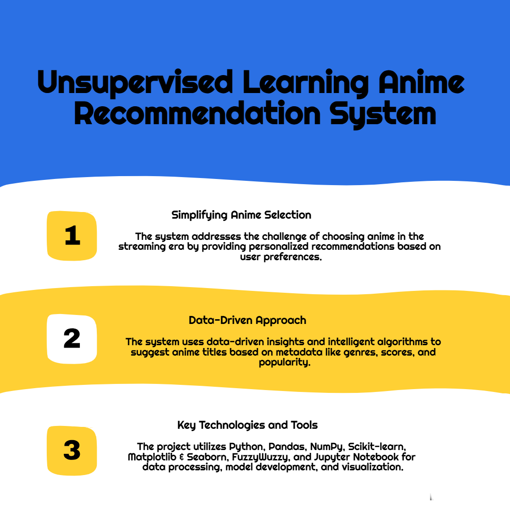

# Anime Recommender using Unsupervised Learning 🎯

## Objective 🔍  
Build a content-based anime recommendation system using clustering—no user history required.

---

## About the Project 📘  
Developed during a 4-week AI + Azure Internship (May 2025) by **Edunet Foundation**, this project recommends anime titles using unsupervised learning (K-Means) based on synopsis and genre.

---

## Project Workflow 📊  
  
*A visual summary of data flow and tools used.*

---

## Methodology 🛠️  

1. **Load Data**: Anime info including synopsis, genres, and scores.  
2. **Preprocessing**: Clean and vectorize synopses using **TF-IDF**.  
3. **Clustering**: Apply **K-Means** to group similar anime.  
4. **Recommendation**: Suggest titles from the same cluster as input anime.

---

## Example 💡  
**Input**: `"Naruto"`  
**Output**: Similar anime like _"Angel Beats!"_, _"Platinum End"_ etc. 🎥

---

## Run Instructions ▶️  

1. Open `Unsupervised_Anime_Recommendation_System.ipynb` in Google Colab or locally.  
2. Execute all cells:  
    - Load dataset  
    - Preprocess & vectorize  
    - Fit model  
    - Call the function below:

```python
get_recommendations('Bleach') 
get_recommendations('Naruto')
get_recommendations('Bleech')  # typo test with fuzzy matching
```

---

## Tech Stack 🧰  
- Python (Colab)  
- `pandas`, `numpy`, `scikit-learn`  
- `matplotlib`, `seaborn` (optional for visuals)  
- `nltk` (optional for NLP)

---

## Future Scope 🔮  

- Web interface (Flask/Streamlit)  
- Add collaborative filtering  
- Include user reviews  
- Filter-based recommendations (genre/score)

---

## Mentors & Inspiration 🙌  

Inspired by [Rohit Shelar Sir](https://github.com/therohitshelar97/MovieRecommendationUsingUnsupervisedLearning/blob/main/Movie%20Recommendation.ipynb)  
Guided by:  
- **Rohit Shelar Sir**  
- **Karthiga S Mam**  
- **Thoufiq Ahmad Sir**

---

## Author 📌  
**Somapuram Uday**  
Final Year CSE Student, GPREC(A), Kurnool, AP  
Intern – Edunet Foundation | AI + Azure Virtual Internship 🎓

---

## Next Steps ✅  

- Fork & clone this repo  
- Run the notebook  
- Suggest or contribute improvements  
- Reach out for feedback or collaboration! 💬
